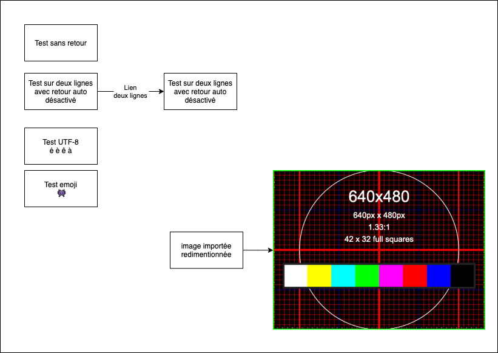

# rel-markdown
## Écrire une fois; présenter et publier n'importe où 
Notes concernant l'écriture en markdown d'une ressource en ligne libre.


* Markdown
  * [](https://github.com/tim-montmorency/rel-markdown/blob/main/README.md)
* HTML (reveal)
  * []
* PDF
  * []


## Outils d'édition d'image 


### Diagram.net (Drawio)
https://app.diagrams.net/

#### Format de travail

XML vs SVG vs PNG


##### drawio(XML)

* - nécessite une conversion vers un format d'image pour intégrer dans des présentation et d'autre document


##### SVG 
* + Préserve le vecteur
* - il faut désactiver le formatage le 'word wrap' afin que la conversion en pdf avec pandoc soit correcte 

voir : https://www.diagrams.net/doc/faq/svg-export-text-problems -> Disable formatted text and word wrap


##### Test SVG


##### PNG
* + compatible avec n'importe quoi 
* ~ preserve le vecteur uniquement dans drawio
* - Le texte n'est pas précis 
* - le texte n'est pas sélectionnable


##### Test PNG



## Outils de présentation


### RevealJS

Permet de présenter un fichier markdown sous forme de présentation en ligne
https://opensource.com/education/13/10/teaching-with-revealjs


#### Cloner via sous-module 

* [https://gist.github.com/viegelinsch/1885ad4c3f2c85b615b946b8aa5d6738](https://gist.github.com/viegelinsch/1885ad4c3f2c85b615b946b8aa5d6738)

dans le repo actuel

```
git submodule add https://github.com/hakimel/reveal.js revealjs
```


#### Exemple de fichier index html

```html
<!doctype html>
<html>
	<head>
		<meta charset="utf-8">
		<meta name="viewport" content="width=device-width, initial-scale=1.0, maximum-scale=1.0, user-scalable=no">

		<title>Rel markdown</title>

		<link rel="stylesheet" href="revealjs/dist/reset.css">
		<link rel="stylesheet" href="revealjs/dist/reveal.css">
		<link rel="stylesheet" href="revealjs/dist/theme/simple.css">

		<!-- Theme used for syntax highlighted code -->
		<link rel="stylesheet" href="revealjs/plugin/highlight/monokai.css">
	</head>
	<body>
		<div class="reveal">
			<div class="slides">
				<section data-markdown="README.md"
					data-separator="^\r?\n\r?\n\r?\n"
					data-separator-vertical="^\r?\n\r?\n"
					data-separator-notes="^Note:"
         			data-charset="utf-8">
    <!--
        Note that Windows uses `\r\n` instead of `\n` as its linefeed character.
        For a regex that supports all operating systems, use `\r?\n` instead of `\n`.
    -->
				</section>
			</div>
		</div>

		

		<script src="revealjs/dist/reveal.js"></script>
		<script src="revealjs/plugin/notes/notes.js"></script>
		<script src="revealjs/plugin/markdown/markdown.js"></script>
		<script src="revealjs/plugin/highlight/highlight.js"></script>
		<script>
			// More info about initialization & config:
			// - https://revealjs.com/initialization/
			// - https://revealjs.com/config/
			Reveal.initialize({
				hash: true,

				// Learn about plugins: https://revealjs.com/plugins/
				plugins: [ RevealMarkdown, RevealHighlight, RevealNotes ]
			});
		</script>
	</body>
</html>

```


#### Visualiser horsligne la présentation 
##### Via vscode ou vscodium
* Utiliser l'extention "Live server"


## Citations


### bibtex

à investiguer

* https://quarto.org/
* https://v4.chriskrycho.com/2015/academic-markdown-and-citations.html
* https://glowkeeper.github.io/Markdown-with-References/
* https://amelon.org/2018/03/13/md-reference.html


